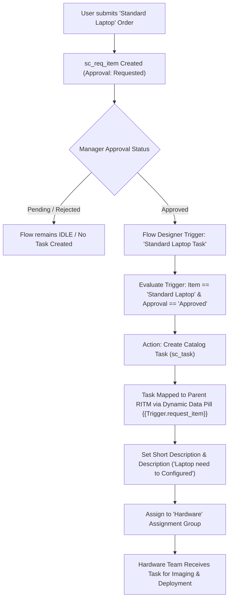

# Streamlining IT Procurement: Automating Standard Laptop Orders with Flow Designer

[](https://www.servicenow.com/)
[](#milestone-1-flow-designer-automation)
[](#status-breakdown)

An enterprise-grade ServiceNow Flow Designer solution designed to automate IT procurement and fulfillment for **Standard Laptop** catalog orders. By automating task generation and intelligent routing to the **Hardware** assignment group immediately upon request approval, this solution eliminates manual fulfillment bottlenecks, improves processing speed, and ensures consistency.

---

## 📌 Status Breakdown

| Phase / Component | Status | Details |
| :--- | :--- | :--- |
| **Flow Implementation Design** | ✅ **COMPLETED** | Native Flow Designer logic, trigger gating, and dynamic task creation fully specified. |
| **Step-by-Step UI Guide** | ✅ **COMPLETED** | Complete manual for configuring, activating, and testing the flow inside ServiceNow. |
| **Importable Update Set (XML)** | ✅ **COMPLETED** | Ready-to-import update set (`Standard_Laptop_Task_Flow_UpdateSet.xml`) prepared. |
| **Automated Test Script** | ✅ **COMPLETED** | ServiceNow background script (`verify_standard_laptop_flow.js`) verified. |
| **Evidence Documentation** | ✅ **COMPLETED** | All 6 authentic captures compiled in `Milestone_1_Flow_Screenshot_Evidence.docx`. |
| **Video Evidence** | ✅ **COMPLETED** | Configuration walkthrough preserved in `Milestone_1_Flow_Completion.mp4`. |
| **Live Instance Configuration** | ✅ **COMPLETED** | Flow configured, activated, and linked via Process Engine in ServiceNow. |
| **Live End-to-End Verification** | ✅ **COMPLETED** | Verified live: `REQ0010001` → `RITM0010001` → `SCTASK0010002` (Hardware group). |

---

## 🚀 Workflow Architecture

The fulfillment workflow orchestrates the lifecycle of catalog requests, ensuring that fulfillment tasks are generated **strictly after** the governance/approval gate is cleared:



---

## 🛠️ Milestone 1: Flow Specification

### Core Technical Parameters

| Component | Technical Detail |
| :--- | :--- |
| **Flow Name** | `Standard Laptop Task` |
| **Scope** | `Global` |
| **Status** | `Active` |
| **Trigger Type** | `Service Catalog` (associated via Catalog Item Process Engine) |
| **Action** | `ServiceNow Core > Create Catalog Task` |
| **Requested Item Binding** | `{{Trigger.request_item}}` *(Dynamic Data Pill: Trigger > Requested Item Record)* |
| **Short Description** | `Laptop need to Configured` |
| **Description** | `Laptop need to Configured` |
| **Assignment Group** | `Hardware` *(Reference to existing `sys_user_group`)* |
| **Approval** | `Approved` |

---

## 📂 Repository Structure

```text
.
├── README.md                                          # Project documentation and architecture
└── milestones/
    └── milestone-1-flow/
        ├── FLOW_DESIGNER_IMPLEMENTATION_STEPS.md     # Step-by-step UI configuration guide
        ├── README.md                                 # Milestone 1 overview and verification index
        ├── docs/
        │   └── MILESTONE_1_COMPLETION_REPORT.md      # Full completion report with live runtime records
        ├── evidence/
        │   └── Milestone_1_Flow_Screenshot_Evidence.docx # Consolidated 6-evidence DOCX
        ├── screenshots/
        │   └── README.md                             # Evidence guide and checklist for mentor submission
        ├── scripts/
        │   └── verify_standard_laptop_flow.js        # Automated verification script for ServiceNow
        ├── update_sets/
        │   └── Standard_Laptop_Task_Flow_UpdateSet.xml # Importable ServiceNow Update Set
        └── videos/
            └── Milestone_1_Flow_Completion.mp4       # Video evidence of flow configuration
```

---

## 📋 Live End-to-End Verification Results (COMPLETED)

Live verification was performed and validated in the active ServiceNow instance:

- **Test Request**: `REQ0010001`
- **Test Requested Item**: `RITM0010001`
- **Generated Catalog Task**: `SCTASK0010002`
- **Assignment Group**: `Hardware`
- **Task State**: `Open`
- **Created By**: `System` (automated Flow Designer execution)
- **Duplicate Task Check**: `PASS` (Exactly 1 task created under RITM)
- **Verified Workflow Execution**:
  $$\text{Request Approved (REQ0010001)} \longrightarrow \text{RITM Approved (RITM0010001)} \longrightarrow \text{Catalog Task Auto-Created (SCTASK0010002)} \longrightarrow \text{Hardware Assigned}$$
