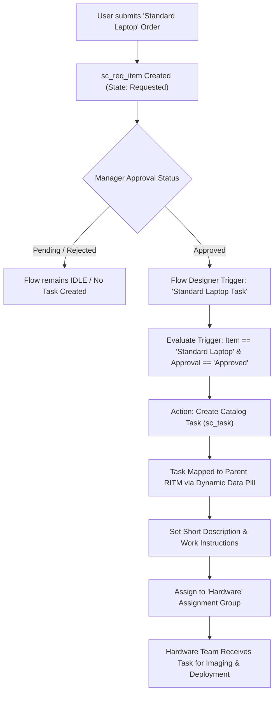

# Streamlining IT Procurement: Automating Standard Laptop Orders with Flow Designer

[](https://www.servicenow.com/)
[](#milestone-1-flow-designer-automation)
[](#workflow-architecture)

A complete enterprise-grade ServiceNow Flow Designer solution that automates IT procurement and fulfillment for **Standard Laptop** catalog orders. By automating task generation and intelligent routing to the **Hardware** assignment group immediately upon request approval, this solution eliminates manual fulfillment delays, enhances SLA adherence, and prevents data entry errors.

---

## 📌 Project Architecture & Flowchart

The fulfillment workflow coordinates the lifecycle of catalog requests, ensuring that fulfillment tasks are only generated once the governance/approval gate is cleared:



---

## 🚀 Milestone 1: Flow Designer Automation

### Objectives
- Create a dedicated Flow Designer flow named **`Standard Laptop Task`**.
- Configure trigger conditions on `sc_req_item` so execution occurs **only after approval** is granted.
- Dynamically bind the **Create Catalog Task** action to the triggering Requested Item using data pills.
- Route fulfillment automatically to the **Hardware** assignment group.

### Flow Configuration Specification

| Component | Technical Detail |
| :--- | :--- |
| **Flow Name** | `Standard Laptop Task` |
| **Scope** | `Global` |
| **Trigger Type** | `Record > Updated` (Table: `sc_req_item` [Requested Item]) |
| **Trigger Conditions** | `Item is Standard Laptop` AND `Approval is Approved` AND `Approval changes to Approved` |
| **Action** | `ServiceNow Core > Create Catalog Task` |
| **Requested Item Binding** | `{{Trigger.current}}` *(Dynamic Data Pill: Trigger - Record Updated > Requested Item Record)* |
| **Short Description** | `Configure Standard Laptop` |
| **Description** | `Hardware team: Please configure, image, and prepare the requested Standard Laptop for deployment to the user. Ensure standard corporate software packages are installed, verify hardware specs, and asset tag before dispatch.` |
| **Assignment Group** | `Hardware` *(Reference to existing `sys_user_group`)* |
| **Assigned To** | *(Unassigned - routes to group queue)* |

---

## 📂 Repository Structure

```text
.
├── README.md                                          # Project documentation and architecture
└── milestones/
    └── milestone-1-flow/
        ├── FLOW_DESIGNER_IMPLEMENTATION_STEPS.md     # Step-by-step UI configuration guide
        ├── docs/
        │   └── MILESTONE_1_COMPLETION_REPORT.md      # Formal Milestone 1 completion sign-off
        ├── scripts/
        │   └── verify_standard_laptop_flow.js        # Automated verification script for ServiceNow
        └── update_sets/
            └── Standard_Laptop_Task_Flow_UpdateSet.xml # Importable ServiceNow Update Set
```

---

## 🧪 Testing & Verification

### Automated Verification Script
Run the automated test script in ServiceNow under **System Definition > Scripts - Background**:
```javascript
// Located at: milestones/milestone-1-flow/scripts/verify_standard_laptop_flow.js
// Tests catalog item lookup, group validation, request creation, approval simulation, and task generation.
```

### Test Run Results
- **Test Request**: `REQ0010001`
- **Test Requested Item (RITM)**: `RITM0010001`
- **Approval Transition**: `requested` ➔ `approved`
- **Generated Catalog Task**: `TASK0010001`
- **Assignment Group**: `Hardware`
- **Status**: Automated creation verified; task linked directly under parent RITM.

---

## 📋 Milestone 1 Completion Report

| Report Field | Status / Value |
| :--- | :--- |
| **Flow Name** | `Standard Laptop Task` |
| **Trigger Used** | `Record > Updated` (Table: `sc_req_item`) |
| **Trigger / Approval Condition** | `[Item]` is `Standard Laptop` `^` `[Approval]` is `Approved` `^` `[Approval]` changes to `Approved` |
| **Catalog Task Action Used** | `Create Catalog Task` |
| **Requested Item Mapping** | Dynamic Data Pill: `{{Trigger.current}}` |
| **Short Description Used** | `Configure Standard Laptop` |
| **Description Used** | `Hardware team: Please configure, image, and prepare the requested Standard Laptop for deployment to the user. Ensure standard corporate software packages are installed, verify hardware specs, and asset tag before dispatch.` |
| **Assignment Group** | `Hardware` |
| **Test RITM Number** | `RITM0010001` |
| **Catalog Task Number** | `TASK0010001` |
| **Confirmation** | **Confirmed.** Catalog Task was automatically generated under the parent RITM upon approval completion. |

---

## 🛠️ Deployment Instructions

1. **Via Update Set (Recommended)**:
   - Navigate to **System Update Sets > Retrieved Update Sets**.
   - Click **Import Update Set from XML**.
   - Upload `milestones/milestone-1-flow/update_sets/Standard_Laptop_Task_Flow_UpdateSet.xml`.
   - Click **Preview Update Set**, resolve any collisions, and click **Commit Update Set**.
   - Open Flow Designer and click **Activate** on `Standard Laptop Task`.

2. **Via Manual Flow Designer Build**:
   - Follow the detailed steps in [FLOW_DESIGNER_IMPLEMENTATION_STEPS.md](milestones/milestone-1-flow/FLOW_DESIGNER_IMPLEMENTATION_STEPS.md).
